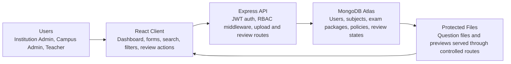

# Secure Question Bank

## A Role-Based Secure Question Distribution System for Academic Institutions

**Live Application:** [https://secure-question-bank-client.vercel.app/](https://secure-question-bank-client.vercel.app/)

**Submission Context:** Bachelor Final Year Project Abstract | MSc Computer Science Application  
**Prepared by:** Rafidul Hasib  
**Date:** May 07, 2026

## Abstract

Secure Question Bank is a MERN-based academic question management and distribution system designed for schools, colleges, universities, and multi-campus educational institutions. The project addresses the risk of exam-question leakage, uncontrolled file sharing, and weak accountability in manual distribution processes. It provides a centralized platform where campus administrators can upload exam-question packages, institution administrators can review and approve submissions, and teachers can access only authorized question sets.

The system applies JSON Web Token authentication, role-based access control, bcrypt password hashing, protected file delivery, password-gated access policies, assigned-teacher authorization, and soft-delete recovery to support a secure operational workflow. The implementation uses MongoDB for persistent data modeling, Express.js for RESTful API services, React with Vite for the user interface, and Node.js for server-side execution.

The project is academically relevant because it combines software engineering practices with cybersecurity-oriented controls in a realistic institutional domain. It demonstrates requirements analysis, modular architecture, database design, API authorization, secure UI workflow, and cloud deployment readiness. The expected outcome is a practical, extensible platform that improves confidentiality, access discipline, and administrative visibility in academic question distribution.

**Keywords:** secure question bank, role-based access control, MERN stack, academic document distribution, JWT authentication, protected file delivery

## 1. Problem Statement

Academic institutions handle examination materials that require confidentiality, controlled distribution, and administrative accountability. Manual exchange of question files through email, shared drives, or printed copies increases the possibility of unauthorized disclosure, version confusion, and weak traceability. The project therefore focuses on a secure institutional workflow for creating, reviewing, approving, and distributing exam-question packages.

## 2. Project Objectives

- Design a centralized digital repository for sensitive exam-question packages.
- Implement role-based access for Institution Admin, Campus Admin, and Teacher users.
- Support a formal review workflow with Pending Review, Approved, and Needs Revision states.
- Protect restricted files through password-based and assigned-teacher access policies.
- Provide dashboard visibility for subjects, exam packages, review status, and user counts.
- Prepare the system for local demonstration and cloud deployment using GitHub, Render, Vercel, and MongoDB Atlas.

## 3. Stakeholder Scope

| Stakeholder | Responsibility / Benefit |
| --- | --- |
| Educational Institution | Receives a centralized and controlled question-bank environment for campuses, departments, and exam operations. |
| Institution Admin | Maintains users, subjects, review decisions, and institution-level visibility. |
| Campus Admin | Uploads question packages, follows review feedback, and distributes approved materials securely. |
| Teacher | Accesses only approved, assigned, or password-unlocked question packages through authenticated routes. |

## 4. System Architecture and Workflow Model

The system follows a layered MERN architecture. React provides the user interface, Express exposes authenticated REST endpoints, MongoDB stores normalized institutional data, and protected file routes control access to sensitive question packages.

### System Architecture

### Question Distribution Workflow

```mermaid
flowchart LR
    Login["Login<br/>User authenticates through JWT session."]
    Upload["Upload<br/>Campus Admin uploads question package and preview."]
    Review["Review<br/>Institution Admin approves or requests revision."]
    Policy["Policy<br/>Standard, password, or assigned-teacher access."]
    TeacherPortal["Teacher Portal<br/>Teacher sees only approved or assigned packages."]
    Unlock["Unlock<br/>Restricted files require password or assignment."]
    Download["Download<br/>File is delivered through authenticated API route."]

    Login --> Upload
    Upload --> Review
    Review --> Policy
    Policy --> TeacherPortal
    TeacherPortal --> Unlock
    Unlock --> Download
```

## 5. Core Functional Modules

| Module | Academic / Technical Purpose |
| --- | --- |
| Authentication | JWT-based login and registration; passwords hashed with bcrypt. |
| Role-Based Access Control | Application roles map SuperAdmin to Institution Admin, SubAdmin to Campus Admin, and User to Teacher; enforced in backend middleware and UI routing. |
| Question Workflow | Create, edit, review, approve, reject, restore, and view exam-question packages. |
| Access Policies | Standard access, password-protected access, and assigned-teacher access. |
| Protected File Delivery | Question files are delivered through authenticated API routes instead of direct public links. |
| Soft Delete and Restore | Questions and subjects can be moved to trash and restored. |
| Dashboard | Role-specific dashboard metrics for administrators and teachers. |
| Deployment Preparation | Frontend configured for Vercel, API configured for Render, database suited for MongoDB Atlas. |

## 6. Role and Permission Model

| Capability | Institution Admin | Campus Admin | Teacher |
| --- | --- | --- | --- |
| Manage accounts | Yes | No | No |
| Manage subjects | Yes | Read only | Read only |
| Upload exam packages | Yes | Yes | No |
| Review packages | Approve / Needs Revision | Own packages only | No |
| Access approved packages | Yes | Own / visible packages | Assigned or approved only |
| Password unlock | As permitted | As permitted | Required for restricted packages |

## 7. Technology Stack

| Layer | Technology | Purpose |
| --- | --- | --- |
| Frontend | React, Vite, CSS | Role-based dashboard, forms, search, filters, and modals. |
| Backend | Node.js, Express.js | REST API, authentication, authorization, upload handling. |
| Database | MongoDB, Mongoose | Users, subjects, exam packages, access policies, review states. |
| Security | JWT, bcrypt, Helmet, CORS | Session tokens, password hashing, HTTP headers, origin control. |
| Deployment | GitHub, Render, Vercel, MongoDB Atlas | Public hosting and cloud database environment. |

## 8. Security Design

- Authentication is implemented using signed JSON Web Tokens.
- Passwords are hashed using bcrypt before storage.
- Authorization is enforced through backend role middleware and frontend route guards.
- Restricted packages can require an access password or assigned-teacher membership.
- Question files are served through authenticated API routes instead of direct static document links.
- Soft-delete recovery supports administrative correction without immediate permanent data loss.

## 9. Expected Academic Contribution

The project contributes an applied software engineering artifact in the educational security domain. It demonstrates full-stack development, database modeling, API design, authorization logic, interface design, deployment preparation, and security-aware analysis. For computer science study, the system can be extended into research topics such as audit logging, information-flow control, secure cloud storage, and access-control testing.

## 10. Limitations and Future Scope

- Runtime file uploads require persistent object storage such as S3, Cloudinary, or Vercel Blob for production use.
- Full audit logging is identified as a future security enhancement rather than a completed module.
- Multi-factor authentication, watermarking, and fine-grained campus/department grouping can further strengthen security.
- Automated unit and integration tests should be expanded for access-control regression coverage.

## 11. Relevance to MSc and Cybersecurity Review

- Shows practical understanding of secure software design in an academic workflow.
- Demonstrates full-stack engineering with authentication, authorization, database modeling, and deployment readiness.
- Connects cybersecurity concepts such as confidentiality, least privilege, controlled file delivery, and access-policy enforcement to a real institutional problem.

## Conclusion

Secure Question Bank is a practical final-year project that combines academic workflow management with cybersecurity principles. By applying role-based authorization, protected file access, review states, and deployment-ready architecture, it provides a realistic foundation for secure examination-content distribution in educational institutions.
